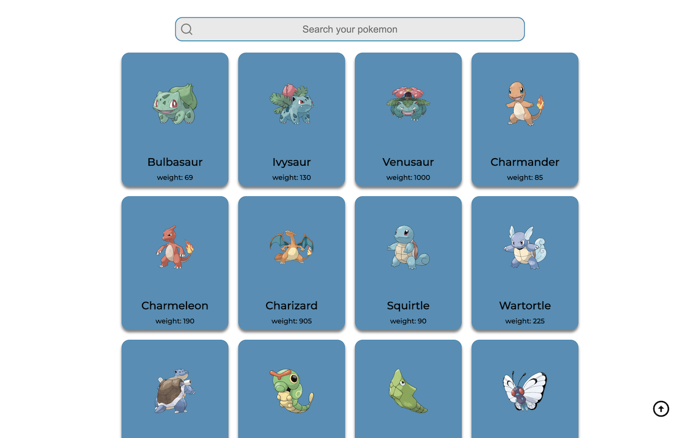

# Pokemon API info

Api fetch on pokemon, detailing their abilities and stats, built with React, Typescript and Sass.

# Motive

Built as part of numerous projects basically for diverse http calls and ...

# Status

Still in progress and currently on 70% done.

# Screenshots

# FrameWork/stacks/libraries

React
Javascript
Typescript
React router
Axios
Docker
React card Flip
Pokemon API
HTML/CSS

# Installation

Open app in IDE
npm install to install dependencies
npm start to deploy app
